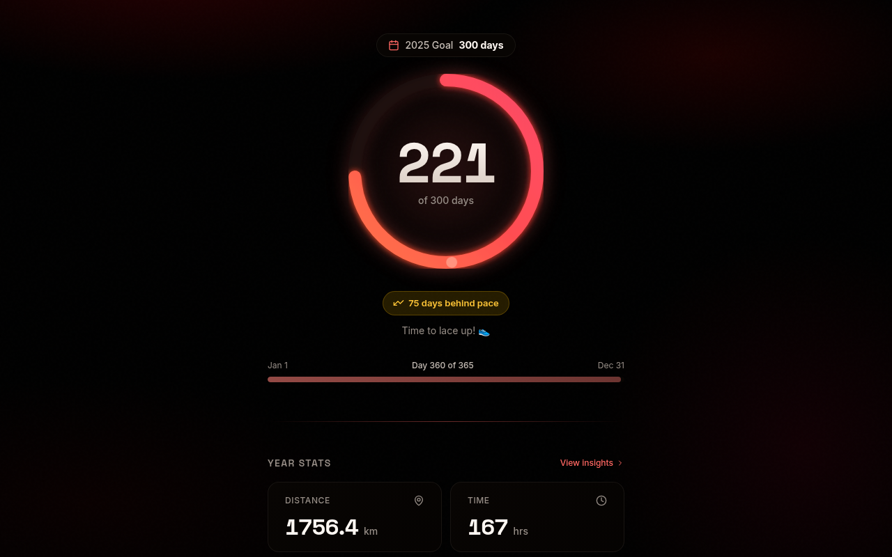
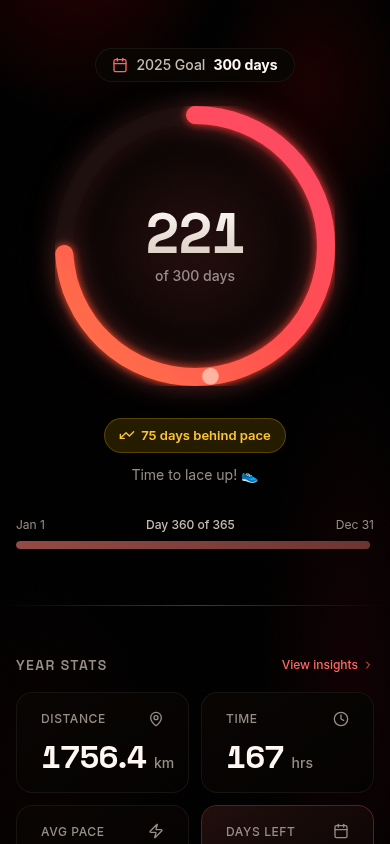

# Running Days

<p align="center">
  
</p>

<p align="center">
  <strong>221 days. 1,756 km. One year of consistent running.</strong>
</p>

## Why Days, Not Streaks?

**Streaks are fragile. Consistency is sustainable.**

Most fitness apps celebrate streaks—run every single day or watch your progress reset to zero. Miss one day due to illness, travel, or life? Your 47-day streak becomes worthless.

**Running Days takes a different approach**: track the *total number of days* you run each year, aiming for a realistic goal like 300 days.

### The Math of Consistency

| Approach | Days Off Allowed | Reality |
|----------|------------------|---------|
| Daily Streak | 0 days/year | Unsustainable, leads to injury |
| 300 Days Goal | 65 days/year | ~5 days/week, room for rest & life |

With a 300-day goal, you can:
- Take a full week off when sick
- Skip runs during travel
- Rest when your body needs it
- Still achieve an impressive 82% running rate

<p align="center">
  
</p>

<p align="center">
  <em>Track your year-long journey, not just your current streak</em>
</p>

## Features

- **Year-Long Progress**: See your running days accumulate throughout the year
- **On-Track Indicator**: Know if you're ahead or behind your goal pace
- **Automatic Sync**: Connects to Apple Health via Health Auto Export
- **Lifetime Stats**: Total distance, time, and average pace
- **PWA Support**: Install on your phone for quick access
- **Beautiful Dark UI**: Easy on the eyes during early morning runs

## How It Works

1. **Set your goal** (default: 300 running days per year)
2. **Run when you can** - morning, evening, 5K or marathon
3. **Watch your days add up** - every run counts as one day
4. **Stay on pace** - the app shows if you're ahead or behind

Multiple runs in one day? Still counts as 1 day. The focus is on *showing up consistently*, not logging maximum volume.

## Tech Stack

- **Framework**: SvelteKit 2 with Svelte 5 (runes)
- **Styling**: Tailwind CSS 4 with OKLCH color system
- **Database**: SQLite with Drizzle ORM
- **Charts**: LayerChart for data visualization
- **UI**: bits-ui + lucide-svelte icons

## Quick Start

```bash
# Clone and install
git clone https://github.com/acedergren/running-days.git
cd running-days
npm install

# Set up database
npm run db:generate
npm run db:migrate

# Start dev server
npm run dev
```

## Connecting Apple Health

This app syncs with [Health Auto Export](https://www.healthexportapp.com/) for automatic workout imports:

1. Install Health Auto Export on your iPhone
2. Create a webhook token in your Running Days database
3. Configure the webhook URL: `https://your-domain.com/api/webhook?token=YOUR_TOKEN`
4. Select "Running" workouts and enable auto-sync

## Development

```bash
npm run dev          # Start dev server
npm test             # Run tests (42 passing)
npm run check        # TypeScript check
npm run db:studio    # Open Drizzle Studio
```

## License

GNU Affero General Public License v3.0 - see [LICENSE](LICENSE)

---

<p align="center">
  <em>Built for runners who want sustainable consistency, not unsustainable perfection.</em>
</p>
