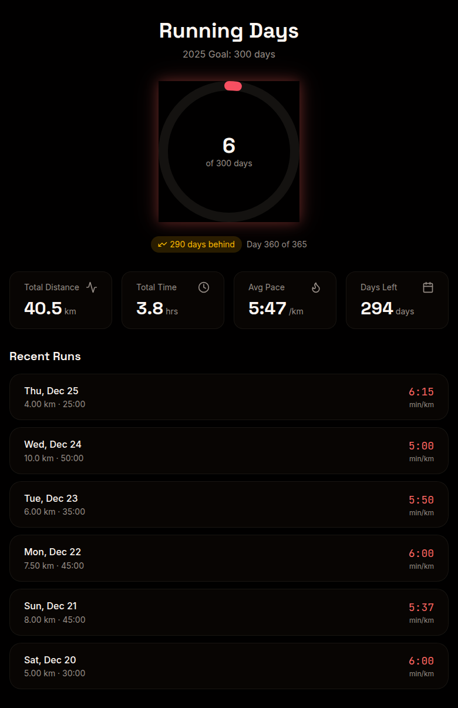

# Running Days

<p align="center">
  
</p>

Track your running goal of 300 unique running days per calendar year. Integrates with Apple Health via [Health Auto Export](https://www.healthexportapp.com/) to automatically sync your workouts.

## Features

- **Goal Tracking**: Visual progress toward 300 running days per year
- **Automatic Sync**: Webhook integration with Health Auto Export iOS app
- **Statistics**: Total distance, time, pace trends, and more
- **PWA Support**: Add to home screen for app-like experience
- **Dark Theme**: Beautiful bioluminescence-inspired dark UI

## Tech Stack

- **Framework**: SvelteKit 2 with Svelte 5
- **Styling**: Tailwind CSS 4 with OKLCH color system
- **Database**: SQLite with Drizzle ORM
- **Charts**: LayerChart (Svelte-native D3 wrapper)
- **UI Components**: bits-ui + custom components
- **Icons**: lucide-svelte

## Getting Started

### Prerequisites

- Node.js 22+
- pnpm (recommended) or npm

### Installation

```bash
# Clone the repository
git clone https://github.com/acedergren/running-days.git
cd running-days

# Install dependencies
pnpm install

# Generate database migrations
pnpm db:generate

# Run database migrations
pnpm db:migrate

# Start development server
pnpm dev
```

### Setting Up Health Auto Export

1. Install [Health Auto Export](https://apps.apple.com/app/health-auto-export/id1115567069) on your iPhone
2. Create a webhook token in the app's settings or database
3. Configure the webhook URL in Health Auto Export:
   ```
   https://your-domain.com/api/webhook?token=YOUR_TOKEN
   ```
4. Select "Running" workouts to export
5. Enable automatic sync

## Project Structure

```
src/
├── lib/
│   ├── components/
│   │   ├── charts/       # LayerChart visualizations
│   │   └── ui/           # Reusable UI components
│   ├── server/
│   │   └── db/           # Drizzle schema and database
│   └── utils.ts          # Utility functions
├── routes/
│   ├── api/
│   │   └── webhook/      # Health Auto Export webhook
│   ├── +layout.svelte
│   ├── +page.server.ts   # Server-side data loading
│   └── +page.svelte      # Dashboard
└── app.css               # Global styles and design tokens
```

## API

### Webhook Endpoint

`POST /api/webhook?token=YOUR_TOKEN`

Accepts workout data from Health Auto Export. Automatically filters for running workouts and updates daily statistics.

### Query Parameters

- `token` (required): Your webhook authentication token

## Deployment

### Docker

```bash
docker build -t running-days .
docker run -p 3000:3000 -v ./data:/data running-days
```

### Self-hosted

```bash
pnpm build
node build/index.js
```

## Environment Variables

| Variable | Description | Default |
|----------|-------------|---------|
| `NODE_ENV` | Environment mode | `development` |
| `PORT` | Server port | `3000` |

## License

This project is licensed under the GNU Affero General Public License v3.0 - see the [LICENSE](LICENSE) file for details.

## Contributing

Contributions are welcome! Please read the contributing guidelines before submitting a PR.

1. Fork the repository
2. Create your feature branch (`git checkout -b feature/amazing-feature`)
3. Commit your changes (`git commit -m 'Add amazing feature'`)
4. Push to the branch (`git push origin feature/amazing-feature`)
5. Open a Pull Request
