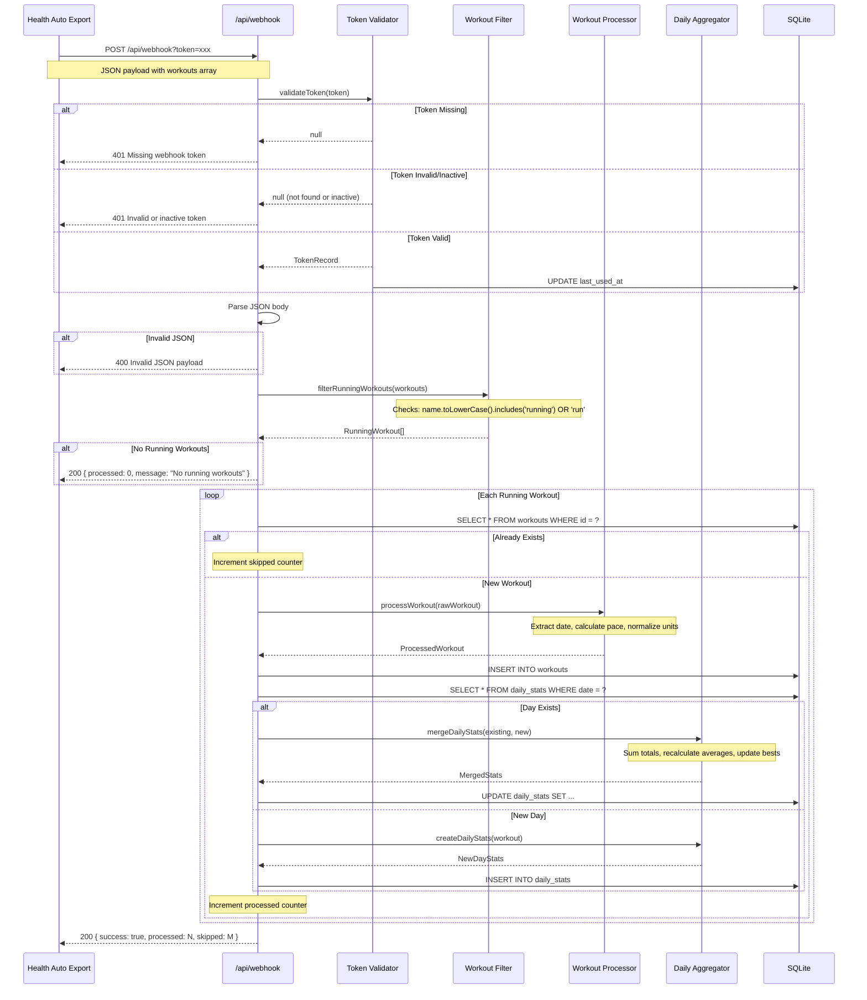
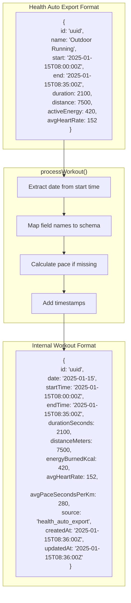
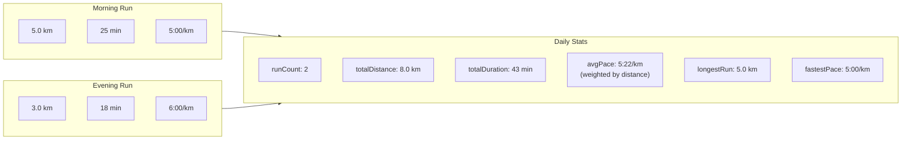
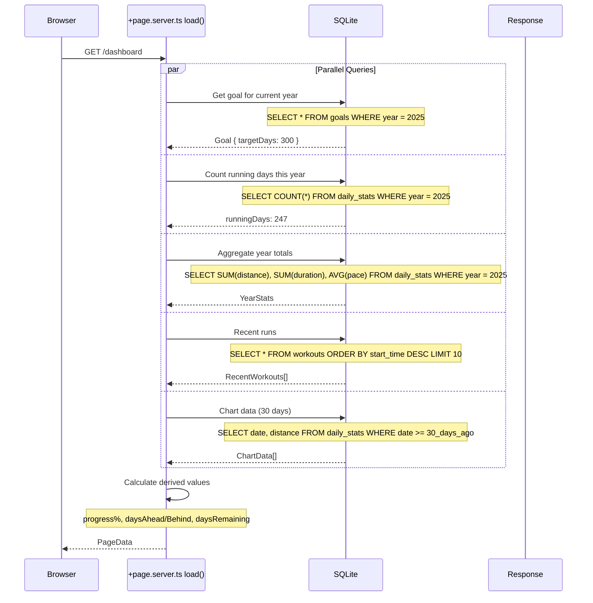
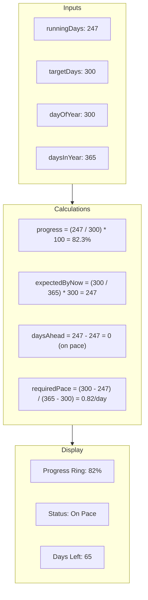
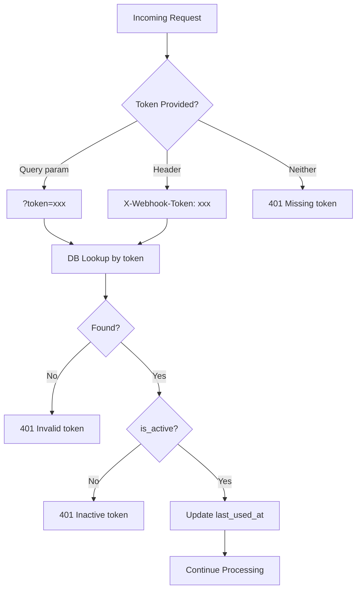
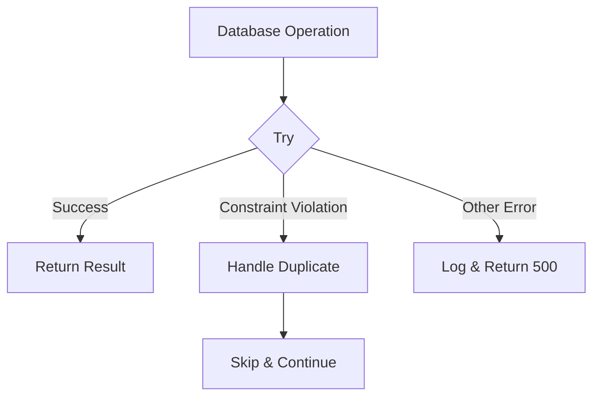
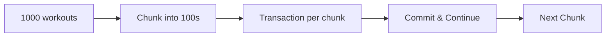

# Data Flow Documentation

Detailed data flow diagrams for the Running Days application.

## Workout Import Pipeline

### Complete Webhook Processing Flow



### Data Transformation Stages



## Daily Aggregation Logic

### Multi-Workout Day Merging



### Pace Calculation Formula

```
Average Pace (weighted) = Total Duration / Total Distance

Example:
- Run 1: 5km in 25min = 5:00/km (300 sec/km)
- Run 2: 3km in 18min = 6:00/km (360 sec/km)

Simple average: (300 + 360) / 2 = 330 sec/km = 5:30/km (WRONG)

Weighted average: (25 + 18 min) / (5 + 3 km)
                = 43 min / 8 km
                = 5.375 min/km
                = 5:22/km (CORRECT)
```

## Dashboard Data Loading

### Page Server Load Sequence



### Derived Calculations



## Insights Page Data Flow

### Chart Data Aggregation

```mermaid
sequenceDiagram
    participant Browser
    participant Load as +page.server.ts
    participant DB as SQLite

    Browser->>Load: GET /insights

    Load->>DB: Get all daily_stats for year
    DB-->>Load: DailyStats[]

    Load->>Load: Transform for charts
    Note over Load: Group by week, month<br/>Calculate moving averages<br/>Identify trends

    Load->>DB: Get workout details for selected range
    DB-->>Load: Workouts[]

    Load-->>Browser: {
        dailyDistance: [...],
        weeklyTotals: [...],
        monthlyProgress: [...],
        paceTrend: [...],
        workouts: [...]
    }
```

### Chart Data Transformations

| Chart | Source | Transformation |
|-------|--------|----------------|
| Distance Bars | `daily_stats.total_distance_meters` | Convert to km, filter to range |
| Pace Trend | `daily_stats.avg_pace_seconds_per_km` | Convert to min:sec format |
| Weekly Totals | `daily_stats` | Group by ISO week, sum distances |
| Monthly Progress | `daily_stats` | Group by month, count days |
| Calendar Heatmap | `daily_stats.date` | Map dates to intensity values |

## Token Authentication Flow



## Error Handling

### Error Response Mapping

| Scenario | Status | Response |
|----------|--------|----------|
| No token in request | 401 | `{ message: "Missing webhook token" }` |
| Token not found | 401 | `{ message: "Invalid or inactive webhook token" }` |
| Token marked inactive | 401 | `{ message: "Invalid or inactive webhook token" }` |
| Malformed JSON | 400 | `{ message: "Invalid JSON payload" }` |
| No workouts in payload | 200 | `{ success: true, processed: 0, message: "No running workouts in payload" }` |
| All duplicates | 200 | `{ success: true, processed: 0, skipped: N }` |

### Database Error Handling



## Performance Considerations

### Query Optimization

| Query | Index Used | Notes |
|-------|------------|-------|
| Lookup workout by ID | Primary Key | O(1) lookup |
| Daily stats by date | Primary Key | O(1) lookup |
| Daily stats by year | `daily_stats_year_idx` | Fast range scan |
| Workouts by date | `workouts_date_idx` | Fast range scan |
| Recent workouts | Table scan | Consider adding start_time index |

### Batch Processing

For large imports (historical data):


