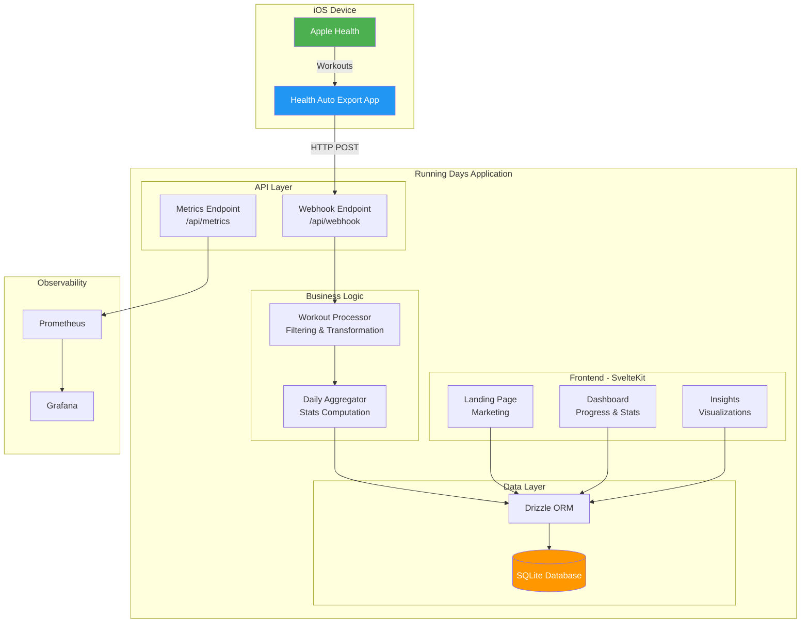
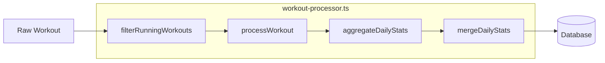
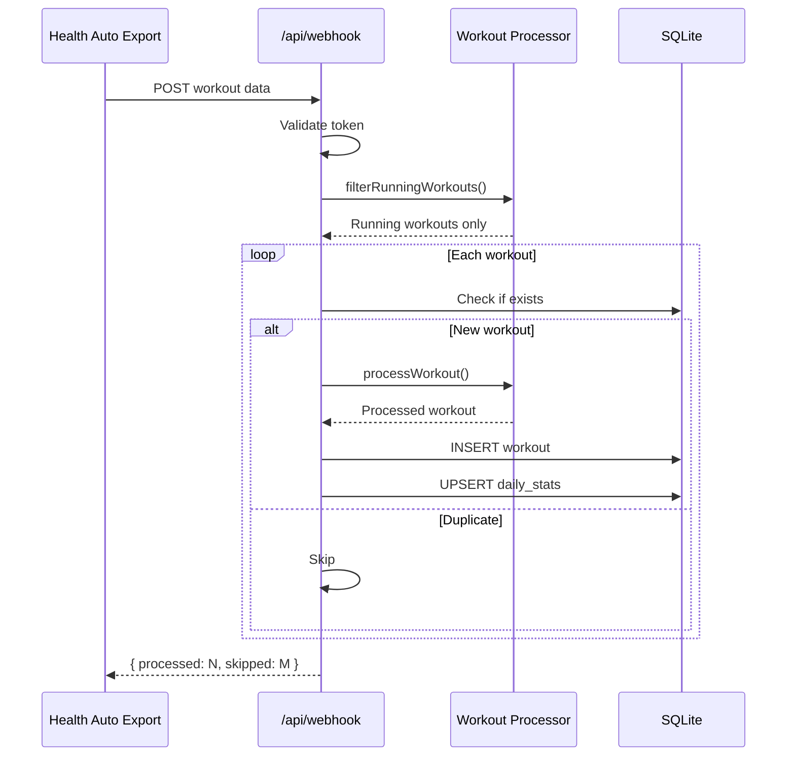
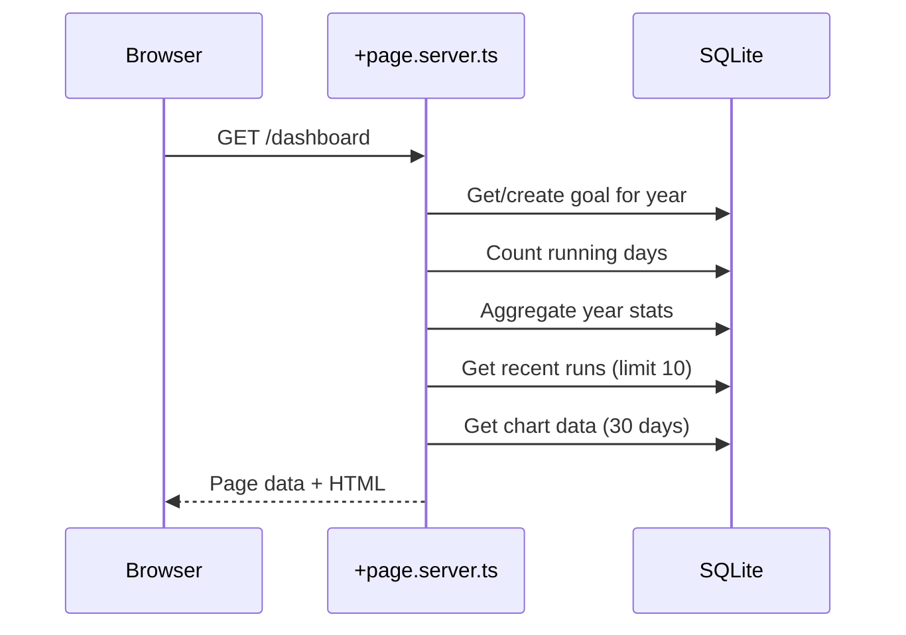
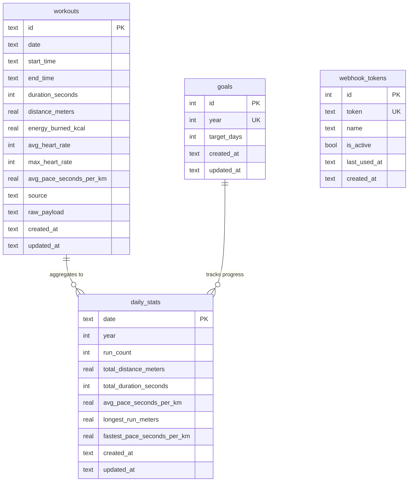

# System Architecture

Running Days is a fitness tracking web application that counts unique running days toward a yearly goal. It integrates with Apple Health via the Health Auto Export iOS app.

## High-Level Architecture



## Component Descriptions

### Frontend (SvelteKit)

| Route | Purpose | Data Source |
|-------|---------|-------------|
| `/` | Landing page with marketing content | Static + demo data |
| `/dashboard` | Main dashboard with progress ring | `+page.server.ts` → Database |
| `/insights` | Detailed analytics and charts | `+page.server.ts` → Database |

### API Endpoints

| Endpoint | Method | Purpose |
|----------|--------|---------|
| `/api/webhook` | POST | Receive workout data from Health Auto Export |
| `/api/webhook` | GET | Test webhook connectivity |
| `/api/metrics` | GET | Prometheus metrics for observability |

### Business Logic Layer



#### Key Functions

| Function | Purpose |
|----------|---------|
| `filterRunningWorkouts()` | Filter to only running activities |
| `processWorkout()` | Transform Health Export format → internal format |
| `calculatePaceSecondsPerKm()` | Compute pace from duration/distance |
| `aggregateDailyStats()` | Aggregate multiple workouts per day |
| `mergeDailyStats()` | Merge new workout into existing day's stats |

## Data Flow

### Workout Import Flow



### Dashboard Load Flow



## Database Schema



## Technology Stack

### Runtime
- **Node.js 22+** - JavaScript runtime
- **SvelteKit 2** - Full-stack framework
- **Svelte 5** - UI framework with runes

### Styling
- **Tailwind CSS 4** - Utility-first CSS
- **OKLCH Colors** - Perceptually uniform color space

### Database
- **SQLite** - Embedded database
- **better-sqlite3** - Synchronous SQLite driver
- **Drizzle ORM** - Type-safe SQL queries

### Visualization
- **LayerChart** - Svelte charting library
- **Lucide Icons** - Icon library

### Deployment Options
- **Node.js** - Traditional server deployment
- **Cloudflare Pages** - Edge deployment (static adapter)

## File Structure

```
apps/web/
├── src/
│   ├── lib/
│   │   ├── components/
│   │   │   ├── charts/          # Data visualizations
│   │   │   └── ui/              # Reusable UI components
│   │   ├── server/
│   │   │   └── db/              # Database connection & schema
│   │   ├── utils.ts             # Utility functions
│   │   └── workout-processor.ts # Business logic
│   ├── routes/
│   │   ├── api/
│   │   │   └── webhook/         # Webhook endpoint
│   │   ├── dashboard/           # Main dashboard
│   │   ├── insights/            # Analytics page
│   │   └── +page.svelte         # Landing page
│   └── app.css                  # Design system tokens
├── static/                      # Static assets
├── drizzle/                     # Database migrations
└── docs/                        # Documentation
```

## Scalability Considerations

### Current Limitations
- **SQLite** - Single-writer, best for single-user or low-concurrency
- **No auth** - Currently designed for personal use

### Future Scaling Options
1. **PostgreSQL** - For multi-user support
2. **Redis** - For caching aggregated stats
3. **Auth** - Add authentication for multi-user
4. **Workers** - Background processing for heavy aggregations
